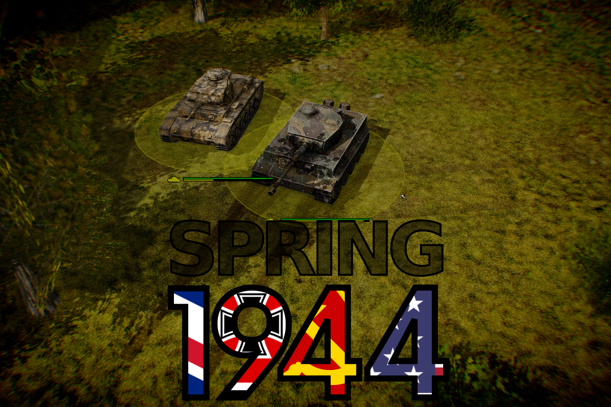
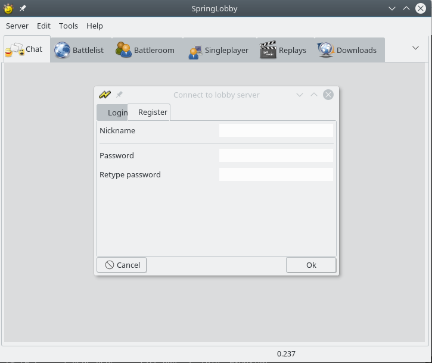
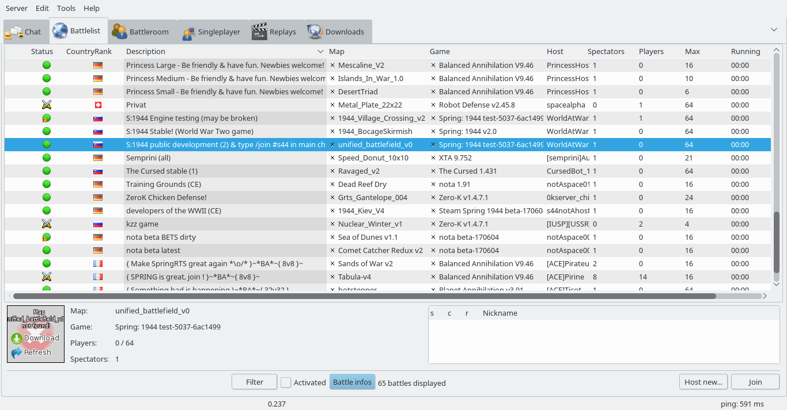
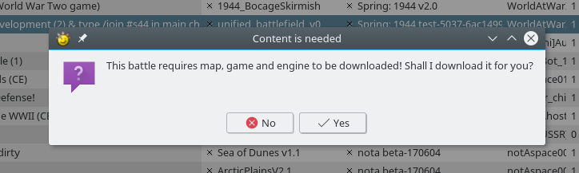
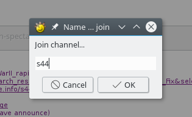
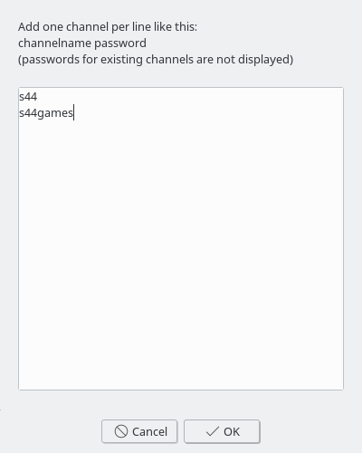
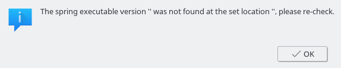
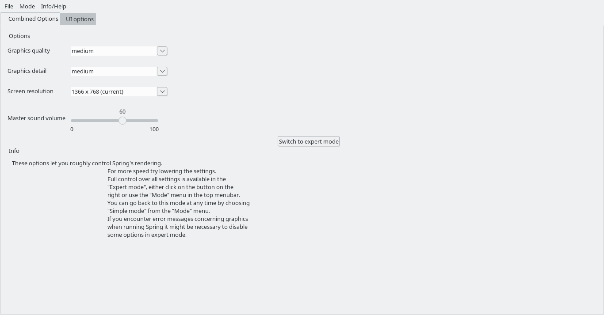
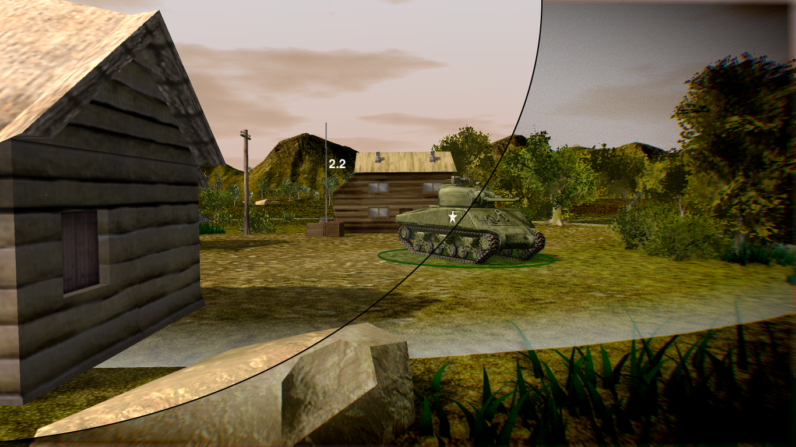

**Spring:1944** is a free, open source (See [License.txt file](docs/License.txt)) WWII themed 3D multiplayer game based on the libre SpringRTS Engine. Our goal is to create a game that is as realistic as possible while still being fun and accessible to play. Games on average take 40 minutes and feature up to 6 factions battling to the last man standing. All factions are complete with several types of infantry, towed and self-propelled guns, normal and rocket artillery, tanks, aircraft and littoral naval assets. The game supports big matches with thousands of units and double digit player counts.

Version 2.0 of the game lets you play either as one of the axis powers (Germany, Italy, Japan, Hungary), or one of the allies (Great Britain, Soviet Union, United States), or even the Sweeden neutral faction. Of course you can team all of them together as there is no limit to which factions can play in the same in-game alliance.

**Spring:1944** is a full featured game with complex in-game mechanics. To learn more about them we have prepared commented replays, which can be watched [here](https://www.youtube.com/channel/UCuL4DSXgglXR_4LF53HZSZw).

# How to play

4 simple steps are required to start playing [Spring1944](http://spring1944.net)...

## Install springlobby

To start playing you should install [SpringLobby](http://springlobby.info/). Windows users may download and install it from the [web page](http://springlobby.info/), while almost all Linux users can install it directly from the distro repositories. For instance, in Debian based distributions (like Ubuntu or Mint) you may type:

```
sudo apt-get install springlobby
```

Or in Arch-Linux based distributions (like Antergos or Manjaro) you may type:

```
sudo pacman -Sy springlobby
```

## Create a Spring account

When [SpringLobby](http://springlobby.info/) is already installed you can create a new Spring user account just launching it, as can be appreciated in the following figure:



No email confirmation is required.

## Head to one of the rooms

Currently there are 2 official rooms to play [S:1944](http://spring1944.net):
* S:1944 Stable! (World War Two game)
* S:1944 public development (2) & type /join #s44 in main chat

Since **Spring:1944** is currently under heavy development, probably you wanna head to "**S:1944 public development (2) & type /join #s44 in main chat**", where the latest game version is deployed. Just move to **Battlelist** tab, and make double click on the appropiate room:



[SpringLobby](http://springlobby.info/) will ask for confirmation to download the engine, game and map:



And will join the game room! Be patient as SpringLobby downloads the appropriate engine and game versions and the required map. While waiting for the downloads to complete (about 300MB), you can check out our [old official website](http://spring1944.net), and the [in-progress new one](spring1944.github.io).

## Wait for other players

Now you must wait for other players. Sometimes it would take some time... Don't desesperate... it'll come, evetually...

## Looking for help, or contact other players

If you find yourself alone, come into our lobby chat channel and do not hesitate to ask for a game. To do that you can use [SpringLobby](http://springlobby.info/) IRC client, by clicking *Tools/Join Channel...*:



To make [SpringLobby](http://springlobby.info/) autoconnect to the channel at start use *Edit/Autojoin channels*:



After joining the channel, you can chat at tab **Chat**.

We can usually be found every evening (GMT) in the development room where you can join us in testing two new factions: Hungary has been added to the axis team and Sweden is available to those who would rather not to pick sides in this war.

# Notes:

## Important links:

* **Official websites**: [old](http://spring1944.net) and [new](spring1944.github.io)
* **IRC**: (live help) freenode #spring1944 (irc.freenode.net) [click here (webchat)](https://webchat.freenode.net/?channels=%23spring1944)
* **Matrix**: (live help) Matrix channel s44 [click here for webchat](https://riot.im/app/#/room/#s44:matrix.org)
* **Forum**: [springrts community subforum](https://springrts.com/phpbb/viewforum.php?f=45) and [new dedicated forum](https://forum.spring1944.tk/)
* **Wiki**: [main](http://spring1944.net/wiki/index.php?title=Main_Page) and [new](https://github.com/spring1944/spring1944/wiki)
* **Github**: [link](https://github.com/spring1944)
* **Game demo repository**: [here](http://replays.springrts.com/browse/?game_pref=5) and [here](https://think.nsupdate.info/s44/autohosts/demos)

## Minimum system requirements:

* Mid-range x86 64-bit machine built in this decade.
* GNU/Linux, Windows or (depending on your skill level) Mac OS X.

## FAQ:

* You can of course use other lobbies like [Weblobby](http://weblobby.springrts.com/) or [flobby](https://github.com/cleanrock/flobby) (GNU/Linux only).
* If you cannot zoom, type /taview into in-game chat or press ctrl+f2.
* To players using Radeon cards: if you experience crashes, try turning off "forced shaders" in springsettings.

## Executable not found annoying bug

Some versions of [SpringLobby](http://springlobby.info/) have an annoying error that makes impossible to launch the game, reporting the following message in a constant basis:



*The spring executable version "was not found at the set location", please re-check.*

To fix that, just simply restart springlobby. If you are about to start an online game, don't worry, after that you can join the same room, and press **Start** button to enter the game again.

## Boosting graphics

The most relevant [Spring](https://springrts.com) setting can be edited directly at [SpringLobby](http://springlobby.info/), by clicking on Edit/Spring settings:



However, some additional postprocessing effects can be enabled/disabled directly in game, like "Screen Space Ambient Occlusion" and "Color Correction". Just press F11 while in game, and click over them to enable/disable ("Screen Space Ambient Occlusion" may require to quit and restart the game):



# Developers guide

Developing: first install Spring. Then, in your Spring data directory (`~/.spring/` or `Documents & Settings/Games/Spring`), clone this repo into `games/Sll44Main.sdd`. Hack away!
