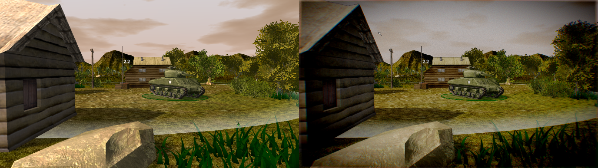

A real-time strategy game using the Spring engine, set in the final days of WWII. Think of it as a cross between Supreme Commander and Company of Heroes, designed by someone who played neither.

It is free-software! See [License.txt file](docs/License.txt)

# How to play

4 simple steps are required to start playing [Spring1944](http://spring1944.net)...

## Install springlobby

To start playing you should install [SpringLobby](http://springlobby.info/). Windows users may download and install it from the [web page](http://springlobby.info/), while almost all Linux users can install it directly from the distro repositories. For instance, in Debian based distributions (like Ubuntu or Mint) you may type:

```
sudo apt-get install springlobby
```

Or in Arch-Linux based distributions (like Antergos or Manjaro) you may type:

```
sudo pacman -Sy springlobby
```

## Create a Spring account

When [SpringLobby](http://springlobby.info/) is already installed you can create a new Spring user account just launching it, as can be appreciated in the following figure:


No email confirmation is required.

## Enter the room

[Spring1944](http://spring1944.net) is currently under heavy development, so usually the best room to play is "S:1944 public development (2) & type /join #s44 in main chat", where the latest game version is deployed. Just move to Battlelist tab, and make double click on the appropiate room:


[SpringLobby](http://springlobby.info/) will ask for confirmation to download the engine, game and map:


The you successfully joined the game room! You can notice that your user has a warning signal. Don't worry, the signal is vanishing when game and map is downloaded.

## Wait for other players

Now you must wait for other players. Sometimes it would take some time... Don't desesperate... it'll come, evetually...

# Looking for help, or players

[SpringLobby](http://springlobby.info/) has a IRC client that can be used to join the s44 channel, where usually some expert [Spring1944](http://spring1944.net) players and developers can be found. You can join such IRC channel by Tools/join channel:


To make [SpringLobby](http://springlobby.info/) autoconnect to the channel at start use Edit/Autojoin channels:


# Engine missconfigured annoying bug

Some versions of [SpringLobby](http://springlobby.info/) have an annoying error that makes impossible to launch the game, reporting the following message in a constant basis:


To fix that, just simply open the setting window, select an engine from left column, apply, close, and restart springlobby. If you are about to start an online game, don't worry, you can join the same room, and press Start button to join the game.

# Boosting graphics

The most important [Spring](https://springrts.com) setting can be edited directly at [SpringLobby](http://springlobby.info/), by clicking on Edit/Spring settings:


However, some additional postprocessing effects can be enabled/disabled directly in game, like "Screen Space Ambient Occlusion" and "Color Correction". Just press F11 while in game, and click over them to enable/disable ("Screen Space Ambient Occlusion" may require to quit and restart the game):



# Developers guide

Developing: first install Spring. Then, in your Spring data directory (`~/.spring/` or `Documents & Settings/Games/Spring`), clone this repo into `games/Sll44Main.sdd`. Hack away!